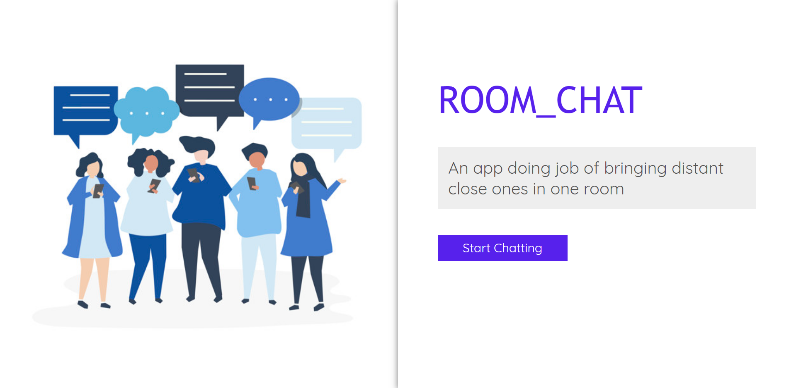

# Room_Chat
Chat app which lets you do conversation like you are in a room.
https://room-chatx.herokuapp.com/

img[alt=images] {
  width: 70%;
  box-shadow: 0 0 10px #000;
}

## Available Scripts

In the project directory, you can run:

### `npm start`

Starts the node server in production environment. 
Open [http://localhost:3000](http://localhost:3000) to view it in the browser.

### `npm run test`

Starts testing of application
